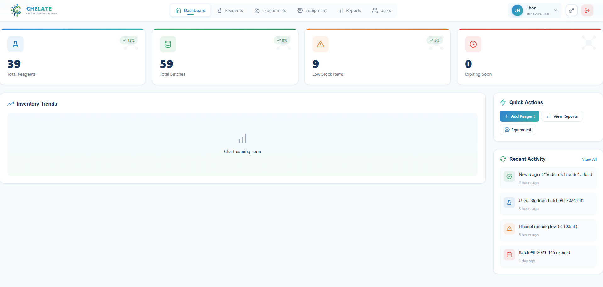
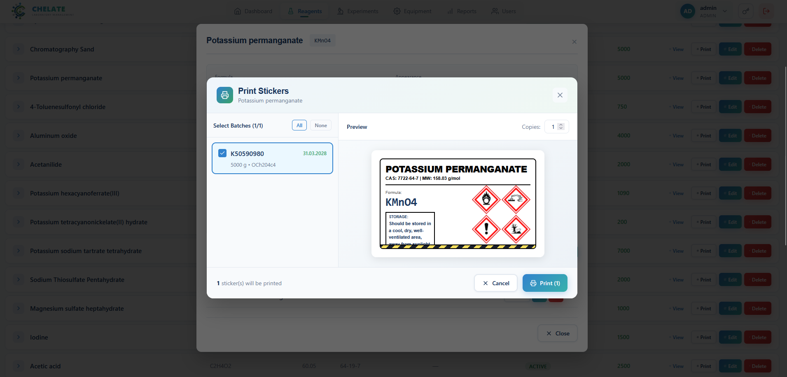
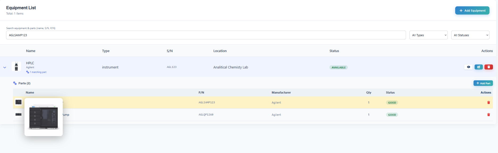
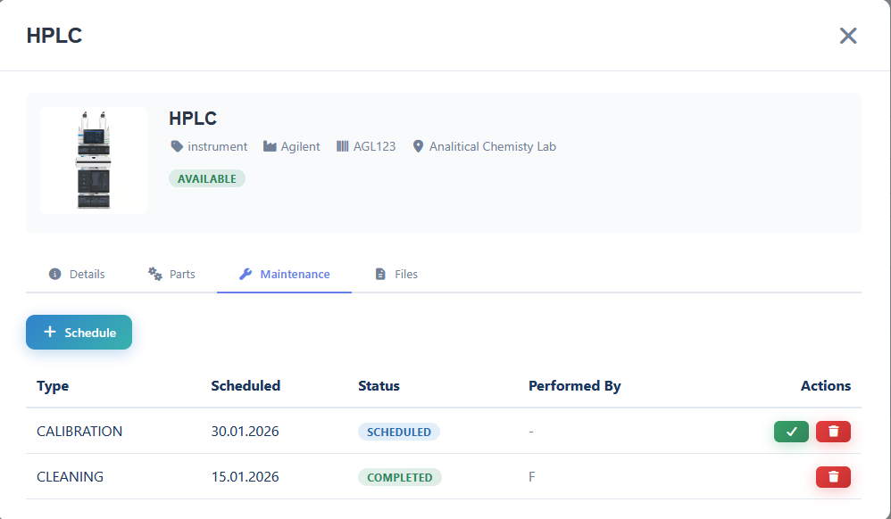
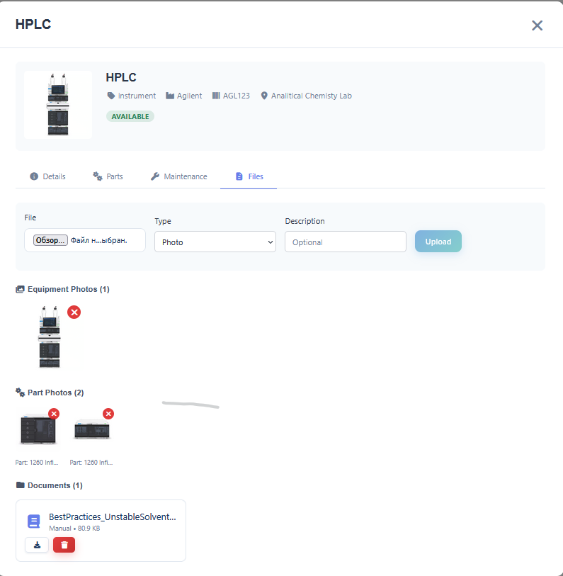
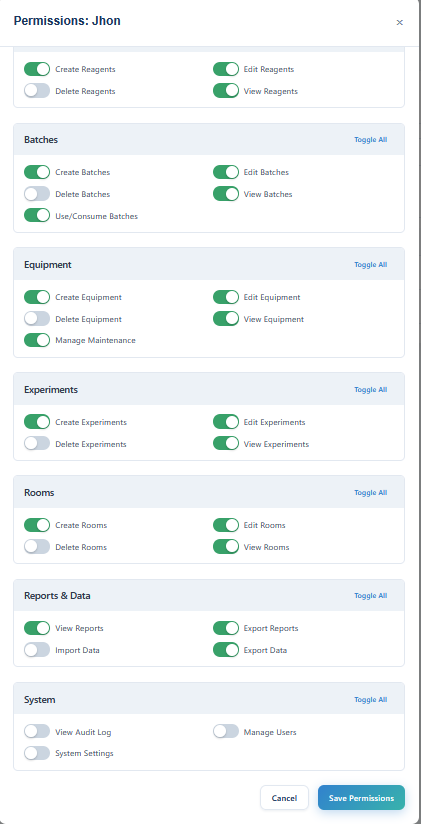

# Chelate LIMS


**A high-performance Laboratory Information Management System built with Rust and React.**

*Currently deployed and actively used in an ISO 17025 certified laboratory environment.*

---

## Overview

Chelate LIMS is a modern web-based system for chemical inventory tracking, equipment maintenance, and laboratory workflow management. Designed specifically for academic and research laboratories, it handles large datasets (100,000+ records) with sub-second query performance.

### Why Chelate?

| Problem | Solution |
|---------|----------|
| Legacy LIMS are slow and clunky | Rust backend delivers sub-millisecond queries |
| Vendor lock-in with proprietary formats | Open-source, SQLite/PostgreSQL, standard APIs |
| Manual paper trails and errors | Digital audit logs, automated workflows |
| Expensive per-seat licensing | Self-hosted, MIT licensed |

> **In Production:** Protocol generation time reduced by ~90%, manual inventory errors eliminated.

---

## Gallery

### Dashboard & Analytics
*Real-time overview of reagent stocks, expiring batches, low-stock alerts, and recent activity feed.*



### Chemical Inventory with Batch Management
*Expandable reagent list with batch tracking, usage history, and quick actions.*


### New Reagent Form (GHS Compliant)
*Comprehensive reagent entry with molecular data, storage conditions, and GHS hazard pictogram selection.*


### Reagent Usage Tracking
*Track consumption history per batch with user attribution and purpose logging.*


### Label Printing with Safety Information
*One-click generation of GHS-compliant stickers with hazard pictograms, CAS numbers, and storage conditions.*



### Equipment Management with Parts Tracking
*Hierarchical equipment structure with sub-component tracking (pumps, samplers, columns).*


### Equipment List View
*Search and filter equipment by type, status, and serial number. Expandable parts view.*



### Maintenance Scheduling
*Track calibrations, cleaning schedules, and maintenance history for ISO 17025 compliance.*



### Equipment Documentation
*Attach photos, manuals, and technical documents to equipment records.*



### Add Equipment Form
*Register new instruments with photos, warranty information, and location tracking.*


### Granular Permission System
*Fine-grained role-based access control per module (Reagents, Batches, Equipment, Experiments, Reports).*



---

## Features

### Chemical Management
- **Full-Text Search** — FTS5-powered instant search across 100k+ records
- **Batch Tracking** — Trace every gram from receipt to usage with lot numbers
- **GHS Classification** — Integrated hazard pictograms and safety data
- **Expiry Alerts** — Automated notifications for expiring chemicals
- **Hierarchical Storage** — Location tracking (Building → Room → Cabinet → Shelf)
- **Bulk Operations** — Import/export thousands of records via CSV/Excel

### Equipment & Assets
- **Maintenance Scheduler** — Calendar integration for calibrations (ISO 17025)
- **Usage Logs** — Immutable digital records replacing paper logbooks
- **Parts Tracking** — Monitor sub-components (lamps, columns, seals)
- **Status Dashboard** — Real-time equipment availability

### Security & Compliance
- **JWT Authentication** — RS256 asymmetric signing with automatic rotation
- **Role-Based Access** — Granular permissions (Admin, Manager, User, Guest)
- **Audit Logging** — Complete activity tracking for regulatory compliance
- **SQL Injection Protection** — Parameterized queries throughout

### Performance
- **Sub-second Queries** — Optimized indexes, CTEs, and window functions
- **Cursor Pagination** — Efficient handling of large result sets
- **Virtual Scrolling** — Smooth frontend UX with massive datasets
- **Connection Pooling** — Concurrent request handling

---

## Tech Stack

| Layer | Technology |
|-------|------------|
| **Backend** | Rust, Actix-web 4.x, Tokio |
| **Database** | SQLite (FTS5) / PostgreSQL, SQLx |
| **Auth** | JWT (RS256), Argon2 password hashing |
| **Frontend** | React 18, TypeScript, TailwindCSS |
| **Build** | Cargo, Vite |
| **Deploy** | Docker, Linux Systemd |

---

## Quick Start

### Prerequisites

- Rust 1.70+ (stable)
- Node.js 18+
- SQLite 3.35+ (for FTS5)

### Installation

```bash
# Clone repository
git clone https://github.com/Emil9405/chelate-lims.git
cd chelate-lims

# Backend setup
cd backend
cp .env.example .env
cargo build --release
cargo run --bin init_db
cargo run --bin generate_keys

# Frontend setup
cd ../frontend
cp .env.example .env
npm install
```

### Running

**Development:**
```bash
# Terminal 1: Backend (http://localhost:8080)
cd backend && cargo run

# Terminal 2: Frontend (http://localhost:3000)
cd frontend && npm run dev
```

**Production:**
```bash
# Backend
cd backend && cargo build --release
./target/release/chelate-lims

# Frontend
cd frontend && npm run build
# Serve dist/ with nginx or similar
```

---

## Project Structure

```
chelate-lims/
├── backend/
│   ├── src/
│   │   ├── main.rs
│   │   ├── config.rs
│   │   ├── models/          # chemical.rs, equipment.rs, user.rs
│   │   ├── handlers/        # REST API endpoints
│   │   ├── database/        # Migrations, queries, connection pool
│   │   ├── middleware/      # Auth, audit logging
│   │   └── utils/
│   ├── Cargo.toml
│   └── .env
├── frontend/
│   ├── src/
│   │   ├── components/      # React components
│   │   ├── services/        # API clients
│   │   ├── hooks/           # Custom hooks
│   │   └── types/           # TypeScript definitions
│   ├── package.json
│   └── .env
├── docs/
│   ├── API.md
│   ├── DATABASE.md
│   └── DEPLOYMENT.md
└── README.md
```

---

## API Reference

### Authentication

```http
POST /api/auth/login
Content-Type: application/json

{"username": "user@lab.edu", "password": "..."}

→ {"access_token": "eyJ...", "refresh_token": "eyJ...", "expires_in": 3600}
```

```http
POST /api/auth/refresh
Authorization: Bearer {refresh_token}

→ {"access_token": "eyJ...", "expires_in": 3600}
```

### Chemicals

| Method | Endpoint | Description |
|--------|----------|-------------|
| GET | `/api/chemicals/search?q=acetone&page=1&limit=50` | Full-text search |
| GET | `/api/chemicals/{id}` | Get by ID |
| POST | `/api/chemicals` | Create new record |
| PUT | `/api/chemicals/{id}` | Update record |
| DELETE | `/api/chemicals/{id}` | Delete record |

**Create Chemical Example:**
```json
{
  "name": "Acetone",
  "cas": "67-64-1",
  "formula": "C3H6O",
  "quantity": 2.5,
  "unit": "L",
  "location": "Building A, Room 101, Cabinet 3",
  "supplier": "Sigma-Aldrich",
  "catalog_number": "179124",
  "batch_number": "SHBL4523"
}
```

### Equipment

| Method | Endpoint | Description |
|--------|----------|-------------|
| GET | `/api/equipment` | List all equipment |
| GET | `/api/equipment/{id}` | Get by ID |
| POST | `/api/equipment` | Register new equipment |
| PUT | `/api/equipment/{id}` | Update record |
| DELETE | `/api/equipment/{id}` | Remove equipment |

---

## Database Schema

### Core Tables

**chemicals**
```sql
id, name, cas, formula, quantity, unit, location,
supplier, catalog_number, batch_number, expiry_date,
ghs_codes, storage_conditions, created_at, updated_at
```

**equipment**
```sql
id, name, type, manufacturer, model, serial_number,
location, status, purchase_date, last_maintenance,
next_calibration, created_at, updated_at
```

**users**
```sql
id, username, password_hash, role, department,
created_at, updated_at
```

**audit_log**
```sql
id, user_id, action, resource, resource_id,
details (JSON), ip_address, timestamp
```

---

## Configuration

Key environment variables (`.env`):

```bash
# Database
DATABASE_URL=sqlite://./data/lims.db
DATABASE_POOL_SIZE=10

# Authentication
JWT_PRIVATE_KEY_PATH=./keys/private.pem
JWT_PUBLIC_KEY_PATH=./keys/public.pem
JWT_EXPIRY_HOURS=1

# Server
HOST=0.0.0.0
PORT=8080
CORS_ORIGINS=http://localhost:3000

# Logging
RUST_LOG=info,actix_web=debug
```

---

## Testing

```bash
# Backend unit & integration tests
cd backend
cargo test
cargo test -- --nocapture  # with output

# Frontend tests
cd frontend
npm test
npm run test:coverage
```

---

## Troubleshooting

| Issue | Solution |
|-------|----------|
| Database locked | Increase `busy_timeout` in config |
| JWT verification failed | Regenerate keys: `cargo run --bin generate_keys` |
| Search not working | Rebuild FTS index: `cargo run --bin rebuild_fts` |
| CORS errors | Check `CORS_ORIGINS` matches frontend URL |

---

## Roadmap

- [x] Core inventory & equipment modules
- [x] Full-text search (FTS5)
- [x] Role-based access control
- [x] Label printing with QR codes
- [x] Audit logging
- [ ] Direct instrument integration (Agilent, Shimadzu)
- [ ] Electronic Lab Notebook (ELN) features
- [ ] Mobile app for QR scanning
- [ ] Chemical supplier API integration
- [ ] Multi-language support (EN, RU, AZ)
- [ ] Cloud backup & sync

---

## Contributing

1. Fork the repository
2. Create a feature branch: `git checkout -b feature/new-feature`
3. Commit changes: `git commit -m 'Add new feature'`
4. Push: `git push origin feature/new-feature`
5. Open a Pull Request

Please follow Rust conventions (`rustfmt`, `clippy`) and add tests for new features.

---

## License

MIT License — see [LICENSE](LICENSE) for details.

---

## Author

**Emil G.**

Research Chemist & Developer at French-Azerbaijani University (UFAZ)

Combining domain expertise in synthetic organic chemistry with systems programming to build better laboratory tools.

---

<p align="center">
  <strong>Version 1.0.0</strong> · Active Development · January 2025
</p>
